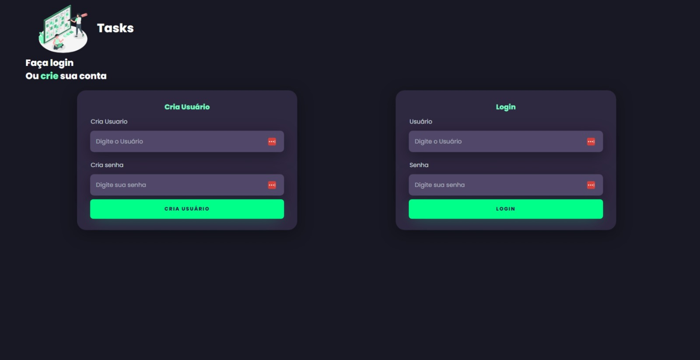
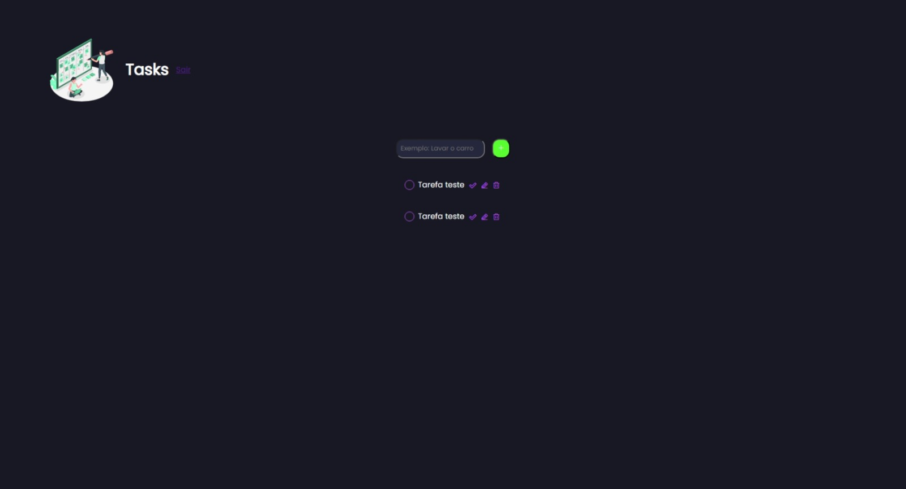

# Tasks

Faculdade Uniasselvi. Seminário interdisciplinar Implementação de uma Aplicação WEB.

A aplicação é uma lista de tarefas online que permite que os usuários criem, visualizem e gerenciem uma lista de tarefas pessoal. A interface de usuário é projetada para ser simples e intuitiva, com uma lista de tarefas na página principal, onde os usuários podem ver todas as suas tarefas atuais.

## Previa da aplicação Tasks
##### Tela de login
 <br>

##### Tela de tarefas
 <br>

## Stack utilizada

    HTML,
    CSS,
    JavaScript,
    PHP,
    Sweetalert2,
    MySql,
    phpdotenv

# o que o app faz

- Adicionar uma tarefa.
- Mostra todas as tarefas.
- Marca a tarefa como realizada ou pendente.
- Deleta a tarefa.

## Variáveis de Ambiente

Para esse projeto, você vai precisar adicionar as seguintes variáveis de ambiente no seu .env essas variavei são para conexão com o banco de dados MySql

`HOST`
`PORT`
`DBNAME`
`USERNAME`
`PASSWORD`

## Criação do banco de dados

```mysql
create database tasker;

create table tb_status(
    id int not null primary key auto_increment,
    status varchar(25) not null
);

insert into tb_status(status)values('pendente');
insert into tb_status(status)values('realizado');

CREATE TABLE td_user (
  id INT NOT NULL PRIMARY KEY AUTO_INCREMENT,
  user VARCHAR(30),
  senha VARCHAR(40)
);

create table tb_tasks(
	id int not null primary key auto_increment,
    fk_status int not null default 1,
    fk_user int not null,
    foreign key(fk_status) references tb_status(id),
    foreign key(fk_user) references td_user(id),
	task text not null,
    data_cadastrado datetime not null default current_timestamp
);
```

## Rodando localmente

Clone o projeto

```bash
  git clone https://github.com/felipe-rodrigues-s/Todo-List.git
```

Entre no diretório do projeto

```bash
  cd Todo-List
```

Instale as dependências

```bash
  composer i
```

Inicie o servidor

```bash
  npm run php
```

## Rodando localmente com o Xampp


Clone o projeto para dentro da pasta htdocs

```bash
  git clone https://github.com/felipe-rodrigues-s/Todo-List.git
```
Instale as dependências

```bash
  composer i
```

Inicie o servidor do Xampp

Navegue para dentro da pasta public

```bash
  http://localhost/Todo-List/public/
```


## Autores

- [@Emílio]()
- [@felipe-rodrigues-s](https://github.com/felipe-rodrigues-s)
- [@Paulo]()
- [@Rogério]()
- [@Wanderson]()
